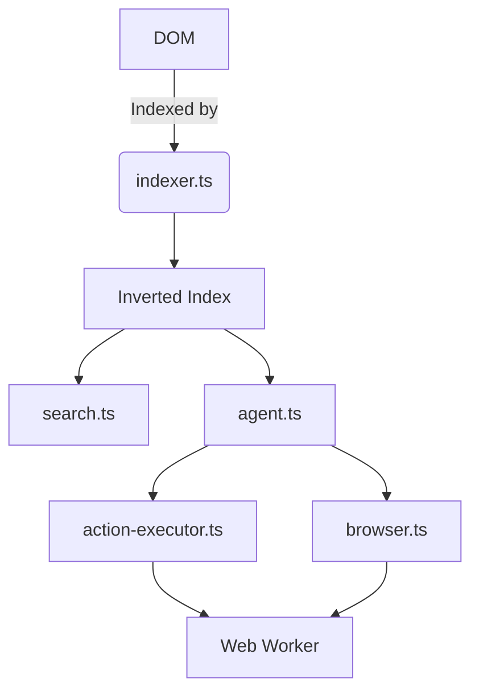

Here’s a **consolidated, actionable prompt** you can directly hand off to an agent. It covers **feature expansion**, **architectural alignment**, **landing page rewrite**, **README updates**, and **parallel development of low-code + programmatic APIs** for agentic workflows.

---

---

---

## **Prompt: Transform Reef into the Go-To Tool for AI Agents on the Live Web**

### **📌 Context & Goals**
**Reef** is a **client-side, privacy-first library** that indexes **live DOM content** (headings, buttons, forms, media, structured data) and enables **AI agents to search, extract, and act** on websites. Unlike static sitemap-based tools (Algolia, Pagefind), Reef reads the **actual DOM**, making it a **dual-purpose tool**:
1. **Search**: Fast, typo-tolerant, faceted queries.
2. **Action/Extraction Layer**: AI agents can **interact with websites** (click, fill forms, navigate) using the DOM as an API.

**Current Features**:
- Live DOM extraction/indexing
- BM25/TF-IDF, autocomplete, stemming, diacritics
- 7 semantic record types
- Local query privacy, MIT licensed
- Serialization/sharding, Web Worker offload (planned)

**Competitive Edge**:
Reef is the **only client-side tool** that combines **live DOM indexing** with **agentic action execution**. Competitors like Playwright/Puppeteer require headless browsers; Reef works **directly in the browser**, with no backend.

**Goal**:
1. **Expand Agentic Capabilities**:
   - Enable **low-code workflows** (JSON/YAML definitions) **and** **programmatic APIs** (`agent.click()`) **in parallel**.
   - Support **multi-step workflows** (e.g., "Login → Scrape Dashboard → Logout").
   - Add **real-time DOM change detection** (e.g., react to AJAX updates).
   - Implement **context-aware queries** (e.g., "Find and click the cheapest flight").
   - Extend **structured data extraction** (JSON-LD, microdata) for richer agent context.
   - Add **session persistence** (cookies, localStorage snapshots).

2. **Architectural Alignment**:
   - Leverage existing modules (`indexer.ts`, `action-executor.ts`, `search.ts`, `browser.ts`).
   - Use `Web Workers` for heavy tasks (indexing, action queues).
   - Extend `types.ts` for agent-specific types (`Action`, `Workflow`, `DOMChangeEvent`).
   - Optimize `cache.ts` for agent session state.

3. **Rewrite Landing Page**:
   - Shift messaging from **"Static Site Search"** to **"AI Agents for the Live Web"**.
   - Highlight **dual use case**: Search + Action.
   - Add **agent-focused examples** and a **competitor comparison table**.

4. **Update README**:
   - Title: *"Reef: AI Agents for the Live Web"*.
   - Add **agentic examples**, **architecture diagram**, and **roadmap**.

---

---

### **📋 Tasks for Agent**

---

#### **1. Agentic Feature Development**
**Objective**: Build a **dual API** for agentic workflows:
- **Low-Code**: JSON/YAML workflow definitions (for non-developers).
- **Programmatic**: Chainable JS API (for developers).

**Key Files to Create/Modify**:
| File | Purpose | Tasks |
|------|---------|-------|
| `agent.ts` | Core agent class | Implement `Agent` class with methods: `click()`, `type()`, `extract()`, `navigate()`, `submit()`. Support **chained actions** (e.g., `agent.click("#btn").type("#input", "text")`). |
| `workflow.ts` | Workflow engine | Design a **declarative DSL** for low-code workflows (JSON/YAML). Example: `{ steps: [{ action: "click", selector: "#login" }, { action: "type", selector: "#password", value: "..." }] }`. Parse and execute workflows. |
| `action-executor.ts` | Action execution | Extend to support **retries on DOM changes** (e.g., if element disappears/reappears). Add **error handling** (e.g., `ElementNotFoundError`). |
| `indexer.ts` | DOM indexing | Index **actionable elements** (buttons, inputs) with metadata (e.g., `{ clickable: true, fillable: false }`). |
| `browser.ts` | Navigation | Add helpers for agents: `agent.navigate(url)`, `agent.back()`, `agent.forward()`. |
| `types.ts` | Type definitions | Add interfaces: `Agent`, `WorkflowStep`, `DOMAction`, `AgentSession`. |
| `cache.ts` | Session management | Store **agent state** (cookies, localStorage). Add `serialize()`/`deserialize()` for workflows. |
| `search.ts` | Contextual queries | Extend to support **intent-based queries** (e.g., "Find and click the login button"). Integrate with `inspector.ts` to validate actionability. |
| `worker.ts` | Offload heavy tasks | Use Web Workers for **workflow execution** and **indexing**. |

**Example Implementations**:
```typescript
// Programmatic API (agent.ts)
class Agent {
  async click(selector: string): Promise<Agent> { /* ... */ }
  async type(selector: string, value: string): Promise<Agent> { /* ... */ }
  async submit(selector?: string): Promise<Agent> { /* ... */ }
  async extract(selector: string): Promise<any> { /* ... */ }
}

// Low-Code Workflow (workflow.ts)
type WorkflowStep = {
  action: "click" | "type" | "navigate" | "extract";
  selector?: string;
  value?: string;
  url?: string;
};
function executeWorkflow(steps: WorkflowStep[]): Promise<void> { /* ... */ }

// Usage Examples
// Programmatic
await reef.agent()
  .click("#login")
  .type("#email", "user@example.com")
  .submit();

// Low-Code
const workflow = [
  { action: "click", selector: "#login" },
  { action: "type", selector: "#email", value: "user@example.com" },
  { action: "submit" }
];
await reef.executeWorkflow(workflow);
```

**Requirements**:
- **Idempotency**: Actions should be retryable if the DOM changes.
- **Validation**: Use `inspector.ts` to check if elements are **actionable** before execution.
- **Event Hooks**: Emit events for **workflow progress** (e.g., `onStepStart`, `onStepError`).
- **Error Recovery**: Auto-retry failed actions (configurable max retries).

---

#### **2. Landing Page Rewrite**
**Objective**: Rebrand Reef as **"The DOM as an API for AI Agents"**.

**Structure**:
```html
<!-- Hero Section -->
<h1>Reef: AI Agents for the Live Web</h1>
<p>Turn any website into a playground for AI agents. Search, extract, and act on live DOM content—no servers, no APIs.</p>
<a href="#demo">Try the Demo</a>

<!-- Features Section -->
<h2>Why Reef?</h2>
<div class="feature">
  <h3>🔍 Search</h3>
  <p>Live DOM indexing with typo tolerance, faceted filtering, and BM25/TF-IDF.</p>
</div>
<div class="feature">
  <h3>🤖 Act</h3>
  <p>Click, type, submit, and navigate. Teach AI agents to interact with any website.</p>
</div>
<div class="feature">
  <h3>🔄 Workflows</h3>
  <p>Define multi-step workflows in JSON or JavaScript. Example: Login → Scrape → Logout.</p>
</div>
<div class="feature">
  <h3>🔒 Privacy-First</h3>
  <p>100% client-side. Your data never leaves the browser.</p>
</div>

<!-- Use Cases -->
<h2>Use Cases</h2>
<div class="use-case">
  <h3>Web Automation</h3>
  <p>Automate repetitive tasks (e.g., form submissions, data entry).</p>
</div>
<div class="use-case">
  <h3>Dynamic Scraping</h3>
  <p>Extract real-time data from dashboards or AJAX-heavy sites.</p>
</div>
<div class="use-case">
  <h3>AI Assistants</h3>
  <p>Build agents that can interact with web apps (e.g., customer support bots).</p>
</div>

<!-- Competitor Comparison -->
<table>
  <tr>
    <th>Feature</th>
    <th>Reef</th>
    <th>Algolia</th>
    <th>Pagefind</th>
    <th>Playwright</th>
  </tr>
  <tr>
    <td>Live DOM Index</td>
    <td>✅</td>
    <td>❌</td>
    <td>❌</td>
    <td>❌</td>
  </tr>
  <tr>
    <td>Client-Side</td>
    <td>✅</td>
    <td>❌</td>
    <td>✅</td>
    <td>❌</td>
  </tr>
  <tr>
    <td>Agent Actions</td>
    <td>✅</td>
    <td>❌</td>
    <td>❌</td>
    <td>✅</td>
  </tr>
  <tr>
    <td>Privacy</td>
    <td>✅ (Local)</td>
    <td>❌</td>
    <td>✅</td>
    <td>❌</td>
  </tr>
</table>

<!-- Example Code -->
<h2>Example: Book a Flight</h2>
<pre>
// Programmatic API
await reef.agent()
  .click("#departure-city")
  .type("#departure-city", "New York")
  .click("#arrival-city")
  .type("#arrival-city", "London")
  .click("#search-flights")
  .click("#cheapest-flight")
  .submit();

// Low-Code Workflow
const workflow = [
  { action: "click", selector: "#departure-city" },
  { action: "type", selector: "#departure-city", value: "New York" },
  { action: "click", selector: "#arrival-city" },
  { action: "type", selector: "#arrival-city", value: "London" },
  { action: "click", selector: "#search-flights" },
  { action: "click", selector: "#cheapest-flight" },
  { action: "submit" }
];
await reef.executeWorkflow(workflow);
</pre>
```

**Tone**:
- **Technical but accessible**: Appeal to both **developers** (API) and **non-developers** (low-code).
- **Agent-First**: Emphasize **interactivity** over static search.

---

#### **3. README Updates**
**Objective**: Align README with the **agentic focus**.

**New Structure**:
```markdown
# Reef: AI Agents for the Live Web

[]
[]
[]

Reef is a **client-side library** that lets AI agents **search, extract, and act** on live DOM content. No servers, no APIs—just pure browser power.

## ✨ Features
- **Live DOM Indexing**: Index headings, buttons, forms, media, and structured data in real-time.
- **Agentic Actions**: Click, type, submit, and navigate—just like a human.
- **Low-Code Workflows**: Define workflows in JSON/YAML for non-developers.
- **Programmatic API**: Chainable methods for developers (e.g., `agent.click().type().submit()`).
- **Privacy-First**: 100% client-side. Your data stays local.
- **Plug-and-Play**: Zero-config, works with any static or dynamic site.

## 🚀 Installation
```bash
npm install @reefjs/reef
```

## 🛠 Usage
### Search
```javascript
const reef = new Reef();
const results = reef.search("cheap flights");
```

### Agentic Actions (Programmatic)
```javascript
const agent = reef.agent();
await agent
  .click("#login-button")
  .type("#email", "user@example.com")
  .submit();
```

### Low-Code Workflows
```javascript
const workflow = [
  { action: "click", selector: "#login-button" },
  { action: "type", selector: "#email", value: "user@example.com" },
  { action: "submit" }
];
await reef.executeWorkflow(workflow);
```

## 🏗 Architecture


## 🔭 Use Cases
- **Web Automation**: Automate repetitive tasks (e.g., form filling, data entry).
- **Dynamic Scraping**: Extract real-time data from dashboards.
- **AI Assistants**: Build agents that interact with web apps (e.g., customer support bots).

## 🗺 Roadmap
- [x] Live DOM indexing
- [x] Typo tolerance & faceted filtering
- [ ] Multi-step workflows (Q3 2026)
- [ ] Real-time DOM change detection (Q3 2026)
- [ ] Session persistence (Q4 2026)
```

**Requirements**:
- Add **badges** for "Agent-Ready", "DOM Actions".
- Include **Mermaid diagram** for architecture.
- Provide **3-4 real-world examples** (e.g., e-commerce checkout, form submission).

---

---
### **📅 Deliverables & Timeline**
| Task | Deliverable | Priority |
|------|-------------|----------|
| Agentic API Design | `agent.ts`, `workflow.ts` stubs + pseudocode | High |
| Low-Code Workflow Engine | JSON/YAML parser + executor | High |
| Programmatic API | Chainable `Agent` class | High |
| DOM Action Validation | Extend `inspector.ts` | Medium |
| Session Management | Extend `cache.ts` | Medium |
| Landing Page Rewrite | HTML/CSS + content | High |
| README Update | Markdown + diagrams | High |
| Competitor Comparison | Table in landing page/README | Medium |

**Suggested Order**:
1. **Design APIs** (`agent.ts`, `workflow.ts`).
2. **Implement Core Agent Class** (programmatic API).
3. **Build Workflow Engine** (low-code).
4. **Update Landing Page/README**.
5. **Add Advanced Features** (session persistence, DOM change detection).

---
---
### **✅ Evaluation Criteria**
1. **Agentic Features**:
   - Are **low-code** and **programmatic APIs** **equally robust**?
   - Do workflows support **retries**, **validation**, and **error recovery**?
   - Is the architecture **scalable** (e.g., Web Workers for heavy tasks)?

2. **Landing Page**:
   - Is the **value prop** immediately clear for **AI practitioners**?
   - Are **examples** practical and easy to follow?
   - Does the **competitor table** highlight Reef’s unique advantages?

3. **README**:
   - Does it **quickly onboard** users to agentic use cases?
   - Are **diagrams/code snippets** accurate and helpful?

4. **Code Quality**:
   - Are **types** (`types.ts`) **comprehensive** for agentic workflows?
   - Are **existing modules** (`indexer.ts`, `search.ts`) **reused effectively**?

---
---
### **🎯 Next Steps for Agent**
1. **Audit Existing Code**:
   - Review `action-executor.ts`, `indexer.ts`, `browser.ts`, and `search.ts` for gaps in agent support.
   - Identify **reusable components** (e.g., DOM traversal in `indexer.ts`).

2. **Prototype Core Agent Class**:
   - Implement a **basic `Agent` class** with `click()` and `type()` methods.
   - Test with a **simple workflow** (e.g., login flow).

3. **Design Low-Code DSL**:
   - Draft a **JSON schema** for workflows.
   - Implement a **parser** in `workflow.ts`.

4. **Iterate on Landing Page/README**:
   - Share drafts for feedback **before finalizing**.

5. **Validate with Examples**:
   - Create **end-to-end demos** for:
     - E-commerce checkout.
     - Form submission.
     - Dynamic data extraction.