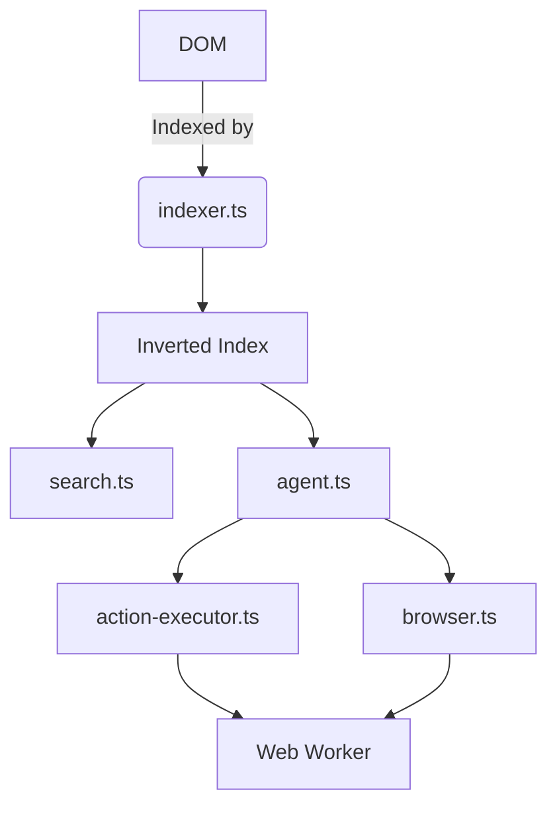

# Reef: AI Agents for the Live Web

[]
[]
[]

> **Notice:** This project is under active development. Expect new versions **daily**, and expect breaking changes between them.

Reef is a **client-side library** that lets AI agents **search, extract, and act** on live DOM content. No servers, no APIs—just pure browser power.

Reef Search is a zero-build, single-script-tag search overlay for static sites. Paste in one `<script>` tag and visitors get a fast, keyboard-first search modal (**Cmd/Ctrl+K**) backed by an in-browser index — no server, no build step, no account.

It crawls your sitemap, extracts page content in the browser, and can optionally surface more than just page text: buttons, form fields, downloadable files, media captions, and structured FAQ data on the pages it indexes.

## Contents

- [Features](#features)
- [How it works](#how-it-works)
- [Architecture](#architecture)
- [Install](#install)
- [Configuration](#configuration)
- [Agentic Workflows](#agentic-workflows)
- [Use Cases](#use-cases)
- [Roadmap](#roadmap)
- [Development](#development)

## Features

- **Live DOM Indexing**: Index headings, buttons, forms, media, and structured data in real-time.
- **Agentic Actions**: Click, type, submit, and navigate—just like a human.
- **Low-Code Workflows**: Define workflows in JSON/YAML for non-developers.
- **Programmatic API**: Chainable methods for developers (e.g., `agent.click().type().submit()`).
- **Privacy-First**: 100% client-side. Your data stays local.
- **Plug-and-Play**: Zero-config, works with any static or dynamic site.

## How it works

1. The page loads the script with `defer`.
2. On boot, Reef looks for `sitemap.xml` (or your configured path) relative to the current page.
3. If a sitemap is found, it fetches the linked pages in parallel (concurrency-limited) and extracts sections, actions, fields, links, files, media, and structured data from each.
4. If no sitemap resolves, Reef falls back to indexing just the current page.
5. Everything is held in an in-memory index — no query ever leaves the browser.
6. Pressing **Cmd/Ctrl+K** opens the modal; typing filters the in-memory index and ranks results by field weight (heading matches score highest, body-word matches lower).
7. Selecting a result navigates to it, focuses a field, or runs a safe same-page action, depending on its type.

## Install

```html
<script src="reef.min.js"></script>
```

Press **Cmd/Ctrl+K** on the page to open the overlay, or use the programmatic API.

## Architecture



## Agentic Workflows

### Programmatic API

```js
const agent = window.Reef.agent();
await agent
  .click("#login-button")
  .type("#email", "user@example.com")
  .submit();
```

### Low-Code Workflows

Define multi-step automation in JSON:

```js
const workflow = [
  { action: "click", selector: "#login-button" },
  { action: "type", selector: "#email", value: "user@example.com" },
  { action: "type", selector: "#password", value: "secret123" },
  { action: "submit" }
];
await window.Reef.executeWorkflow(workflow);
```

### Workflow with Error Handling

```js
await window.Reef.executeWorkflow([
  { action: "navigate", url: "/dashboard" },
  { action: "click", selector: "#refresh" },
  { action: "extract", selector: "#data-table" }
], {
  maxRetries: 3,
  retryDelay: 500,
  onStepError: (step, index, error) => {
    console.error(`Step ${index} failed:`, error);
  }
});
```

## Use Cases

- **Web Automation**: Automate repetitive tasks (e.g., form filling, data entry).
- **Dynamic Scraping**: Extract real-time data from dashboards.
- **AI Assistants**: Build agents that interact with web apps (e.g., customer support bots).

## Configuration

Set these as attributes on the script tag (or `data-*` equivalents where noted).

| Attribute | Default | Purpose |
|---|---|---|
| `data-sitemap` | `/sitemap.xml` | Sitemap path override |
| `data-max-pages` | `500` | Maximum number of sitemap pages to fetch |
| `data-scope` | — | CSS selector limiting extraction to a specific content root |
| `data-index-actions` | `true` | Enable indexing of buttons/toggles (also gates field indexing) |
| `data-index-media` | `true` | Enable indexing of images, video, and audio |
| `data-index-structured-data` | `true` | Enable indexing of JSON-LD structured data |
| `data-index-hidden` | `true` | Include collapsed content such as `<details>` elements |
| `data-file-extensions` | `pdf,doc,docx,xls,xlsx,ppt,pptx,zip,csv` | File-link classification |
| `data-exclude-action` | — | CSS selectors excluded from executable results |
| `data-actions-mode` | `execute` | `execute` or `navigate-only` — see [Safety](#safety-and-execution-model) |
| `data-hotkey` | `ctrlk,cmdk` | Custom keyboard shortcut(s) |
| `data-placeholder` | `Search this site` | Custom input placeholder text |
| `data-primary-color` | `#43d9c8` | Primary accent color |
| `data-background-color` | `rgba(20,30,28,0.65)` | Modal background color |
| `data-text-color` | `#edebe6` | Text color |
| `data-border-color` | `rgba(67,217,200,0.25)` | Border color |
| `data-radius` | `16` | Border radius in pixels |
| `data-mode` | `regular` | `regular`, `opaque`, or `high-contrast` |
| `data-headless` | `false` | When `true`, builds index without rendering the modal |
| `data-use-worker-indexing` | `false` | Offload HTML parsing to a Web Worker for large sites |
| `data-ttl` | `604800` | Cache TTL in seconds (IndexedDB persistence) |
| `data-on-ready` | — | (Runtime API use) Callback fired when index is ready |

## Result types

| Type | Label | Behavior on select |
|---|---|---|
| `section` | Section | Navigates to the heading anchor |
| `action` | Action | Clicks the control if it's safe and on the current page, otherwise navigates first |
| `field` | Field | Focuses (and selects) the matching input |
| `link` | Link | Navigates to the external link |
| `file` | File | Navigates to the downloadable resource |
| `media` | Media | Navigates to the page containing the image/video/audio |
| `structured` | Answer | Shows an inline preview and navigates to the source page |

## Runtime API

- `window.Reef.open()` — opens the modal (no-op in headless mode).
- `window.Reef.close()` — closes the modal (no-op in headless mode).

When in headless mode, use `window.Reef.search(query)` and `window.Reef.getIndex()` to query and access indexed data.

## Developer API

### Agentic APIs

Reef provides programmatic APIs for AI agents to interact with web pages:

```js
// Get all interactive records (actions and fields) for agent tool use
const tools = window.Reef.getAgentTools();
// Returns: [{ name, description, type, selector, id }]

// Execute an action by record ID (respects actionsMode for destructive actions)
window.Reef.act('page.html#action-0').then(result => {
  console.log('Success:', result.success);
  if (!result.success) console.log('Reason:', result.reason);
});

// Fill a field value programmatically (with proper event dispatch)
window.Reef.fillField('page.html#field-2', 'user@example.com').then(result => {
  console.log('Field filled:', result.success);
});

// List all interactive elements on the current page
const interactive = window.Reef.getInteractiveRecords();
```

The `act()` method returns a promise with `{ success: boolean, reason?: string }`. Destructive actions are blocked when `actionsMode !== 'execute'`.

### Headless Mode

For developers who want to build their own UI or integrate Reef into custom projects, use headless mode to get the indexed data without the default modal:

```js
// Initialize in headless mode
window.Reef = new ReefSearch({ headless: true });

// Or via script attribute
<script src="reef.min.js" data-headless="true"></script>
```

```js
// Get all indexed records (available after indexing completes)
const allRecords = window.Reef.getIndex();

// Search the index programmatically
const results = window.Reef.search('installation', 10);

// Set a callback that fires when the index is ready
window.Reef.setOnReady(({ index }) => {
  console.log('Index ready with', index.length, 'records');
});

// Get sitemap URLs without building the index
window.Reef.getSitemapUrls().then(urls => {
  console.log('Found URLs:', urls);
});

// Rebuild the index (useful after adding custom records)
window.Reef.reindex();
```

### Hotkey Management

```js
// Get current hotkey
const current = window.Reef.getHotkey(); // Returns "ctrlk,cmdk" by default

// Set custom hotkey
window.Reef.setHotkey('altk,f'); // Opens with Alt+K or Ctrl+F
window.Reef.setHotkey('ctrlshiftk'); // Opens with Ctrl+Shift+K
```

Supported hotkey keys: `ctrlk`, `cmdk`, `ctrlshiftk`, `altk`, `f`

### Selection Callbacks

```js
// Register callback for selected results
window.Reef.onselect(function(result) {
  console.log('Selected:', result.type, result.headingText);
});

// Remove callback
window.Reef.offselect();
```

The callback receives an `IndexRecord` object with properties:
- `type` — Result type (section, action, field, link, file, media, structured)
- `headingText` — The title/label of the result
- `url` — Target URL
- `breadcrumb` — Page context
- `bodyText` — Full text content
- `destructive` — Whether action is destructive (actions only)
- `selector` — CSS selector for the element (actions/fields only)

### Programmatic Control

```js
// Open with a pre-filled query
window.Reef.openWithQuery('installation');

// Check if modal is open
if (window.Reef.isOpenState()) {
  console.log('Search is open');
}
```

### Index Manipulation

```js
// Get all indexed records
const allRecords = window.Reef.getIndex();

// Search the index programmatically (limit optional, default 8)
const results = window.Reef.search('query', 10);

// Add custom records
window.Reef.addCustomRecords([{
  id: 'custom-1',
  url: window.location.href,
  headingText: 'Custom Result',
  headingId: 'custom-1',
  breadcrumb: '',
  bodyText: 'Custom searchable content',
  type: 'section'
}]);

// Rebuild index (re-crawls sitemap)
window.Reef.reindex();

// Rebuild index and wait for it to complete
window.Reef.rebuildIndex().then(() => {
  console.log('Index rebuilt');
});
```

### Headless Control

```js
// Switch to headless mode (removes modal and hotkey)
window.Reef.setHeadless(true);

// Switch back to regular mode (requires re-initialization)
window.Reef.setHeadless(false);
```

### Runtime Styling

```js
// Update color scheme
window.Reef.setColorScheme({
  primary: '#ff6b6b',
  secondary: '#4ecdc4',
  background: 'rgba(255,255,255,0.8)',
  text: '#111111',
  border: '#cccccc',
  radius: 12
});

// Change mode
window.Reef.setMode('high-contrast'); // or 'opaque', 'regular'

// Set font family
window.Reef.setFontFamily('system-ui, sans-serif');

// Update placeholder
window.Reef.setPlaceholder('Search docs...');
```

### Configuration Inspection

```js
// Get current configuration
const config = window.Reef.getConfig();
console.log(config.hotkey, config.mode);
```

### Custom Modal Examples

#### Minimal Custom Modal

Build your own search interface using the headless API:

```html
<script src="reef.min.js" data-headless="true"></script>

<div id="custom-search" style="display:none;">
  <input type="text" id="search-input" placeholder="Search..." />
  <ul id="search-results"></ul>
</div>
```

```js
const searchModal = document.getElementById('custom-search');
const searchInput = document.getElementById('search-input');
const searchResults = document.getElementById('search-results');

window.Reef.setOnReady(() => {
  searchModal.style.display = 'block';
});

searchInput.addEventListener('input', (e) => {
  const query = e.target.value;
  const results = window.Reef.search(query, 10);
  
  searchResults.innerHTML = results.map(r => `
    <li>
      <strong>${r.headingText}</strong>
      <small>${r.breadcrumb || r.url}</small>
    </li>
  `).join('');
});

// Open your custom modal
document.getElementById('open-search').addEventListener('click', () => {
  searchModal.style.display = 'block';
  searchInput.focus();
});
```

#### React/Vue Component Integration

```jsx
// React example
import { useEffect, useState } from 'react';

function SearchComponent() {
  const [index, setIndex] = useState([]);
  const [query, setQuery] = useState('');
  const [results, setResults] = useState([]);

  useEffect(() => {
    // Wait for Reef to be ready
    if (window.Reef) {
      window.Reef.setOnReady(({ index }) => {
        setIndex(index);
      });
    }
  }, []);

  const handleSearch = (e) => {
    const q = e.target.value;
    setQuery(q);
    setResults(window.Reef?.search(q, 10) || []);
  };

  return (
    <div>
      <input value={query} onChange={handleSearch} placeholder="Search..." />
      <ul>
        {results.map(r => (
          <li key={r.id} onClick={() => window.location.href = r.url}>
            {r.headingText}
          </li>
        ))}
      </ul>
    </div>
  );
}
```

#### Custom Styled Dropdown Search

```js
// Create a dropdown search in your navbar
const createDropdownSearch = () => {
  const container = document.createElement('div');
  container.innerHTML = `
    <div class="dropdown-search">
      <button id="search-trigger">Search</button>
      <div class="dropdown-menu" style="display:none;">
        <input type="text" placeholder="Type to search..." />
        <div class="results"></div>
      </div>
    </div>
  `;
  document.querySelector('nav').appendChild(container);

  window.Reef.setOnReady(({ index }) => {
    const input = container.querySelector('input');
    const resultsDiv = container.querySelector('.results');
    
    input.addEventListener('input', (e) => {
      const results = window.Reef.search(e.target.value, 5);
      resultsDiv.innerHTML = results.map(r => `
        <div class="result" data-url="${r.url}">
          ${r.headingText}
        </div>
      `).join('');
    });
  });
};

createDropdownSearch();
```

#### Build-Time Index Generation

Use Reef in headless mode during static site generation to pre-compute your index:

```js
// In your build script
import { extractSections, createSearchIndex, addToIndex } from 'reef-search';
import { readFileSync, readdirSync } from 'fs';

async function generateIndex() {
  const index = createSearchIndex();
  const files = readdirSync('./docs').filter(f => f.endsWith('.html'));
  
  for (const file of files) {
    const html = readFileSync(`./docs/${file}`, 'utf-8');
    const sections = extractSections(html, `/docs/${file}`);
    addToIndex(index, sections);
  }
  
  // Write index to JSON file
  require('fs').writeFileSync(
    './dist/search-index.json', 
    JSON.stringify(index.allSections)
  );
}
```

#### Custom Result Renderer

```js
const renderResults = (results) => {
  return `
    <div class="custom-results">
      ${results.map(r => `
        <div class="result-item" data-type="${r.type}">
          <span class="type-badge">${r.type}</span>
          <span class="title">${r.headingText}</span>
          <span class="snippet">${r.bodyText.substring(0, 80)}...</span>
          ${r.destructive ? '<span class="warning">⚠️</span>' : ''}
        </div>
      `).join('')}
    </div>
  `;
};

// Use with headless mode
window.Reef.setOnReady(() => {
  document.getElementById('results').innerHTML = renderResults(window.Reef.getIndex());
});
```

## Keyboard shortcuts

- **Cmd/Ctrl+K** — open the modal (configurable via `data-hotkey`).
- **↑ / ↓** — move between results.
- **Enter** — run or navigate to the selected result.
- **Escape** — close the modal.

## Safety and execution model

Because selecting a search result can trigger behavior on the page, execution is deliberately conservative:

- Forms are never auto-filled or auto-submitted — fields only receive focus.
- Labels matching destructive verbs (delete, remove, pay, checkout, confirm, etc.) are flagged as `destructive`.
- Actions on the current page are dispatched as a real click event against the matched element; if the element can't be found, the user sees a toast instead of a silent failure.
- Actions that target a different page are deferred: Reef stores the pending action and navigates there first, resolving it the next time the overlay initializes on that page rather than mutating anything before the destination has loaded.
- With the default `data-actions-mode="execute"`, a destructive action on the *current* page will still run when selected. Set `data-actions-mode="navigate-only"` if you want destructive actions to only scroll to and highlight the element instead of triggering it automatically.

## Current limitations

- **No same-origin crawl fallback.** If no sitemap resolves, Reef indexes only the current page rather than crawling outward from it.
- **No OCR** for images, and no indexing of client-rendered content that only appears after hydration on other pages (fetched HTML doesn't execute scripts).
- Several `data-*` attributes described above are accepted but not yet wired up (see [Configuration](#configuration)).

## Roadmap

- [x] Live DOM indexing
- [x] Typo tolerance & faceted filtering
- [ ] Multi-step workflows (Q3 2026)
- [ ] Real-time DOM change detection (Q3 2026)
- [ ] Session persistence (Q4 2026)

## Development

Install dependencies and build:

```bash
npm install
npm run build
```

The generated bundle is written to `reef.min.js`.

Run the test suite:

```bash
npm test
```
