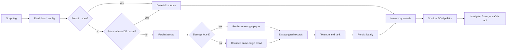
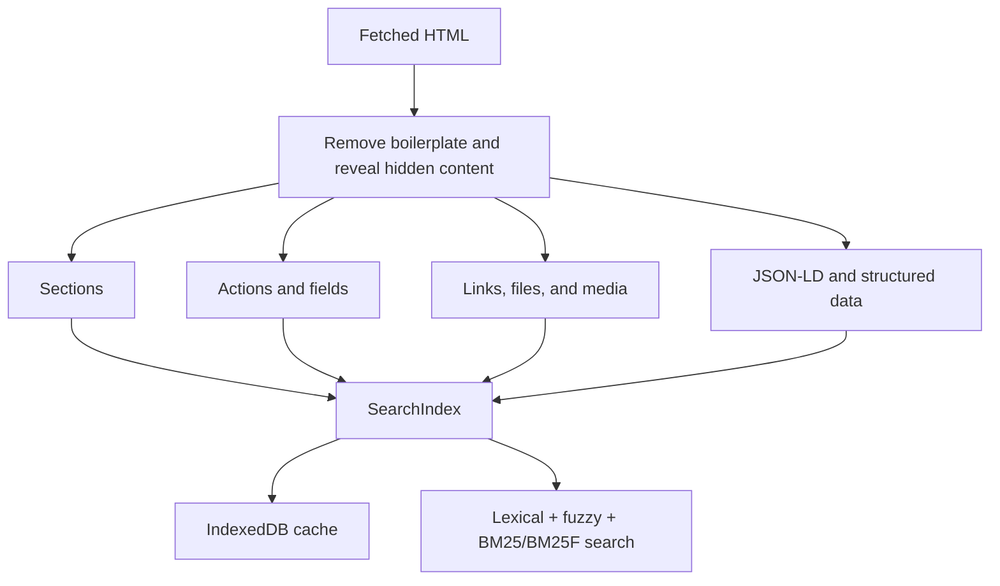

# Reef

### Search the whole site. Find the exact thing. Keep the browser in control.

Reef is a client-side search and interaction layer for static sites. Add one script to a docs site, blog, portfolio, or GitHub Pages project and get a fast `⌘K` / `Ctrl K` palette that searches pages, headings, links, files, media, structured data, and safe on-page actions.

No backend. No account. No query analytics by default. The index is built and searched in the visitor’s browser.


<p>
  <a href="https://www.npmjs.com/package/reef-search"></a>
  <a href="LICENSE"></a>
</p>

## Why Reef

Browser find is page-local. Hosted search adds infrastructure. Reef sits between them: it discovers the site from its sitemap, extracts meaningful records, caches the index locally, and makes the result actionable.

| Search result | What happens on selection |
| --- | --- |
| Section | Navigate to the page and reveal the matching heading |
| Action | Execute a safe visible action on the current page, or navigate first |
| Field | Focus the matching form control |
| Link / file / media | Navigate to the resource |
| Structured data | Surface FAQ and other indexed metadata |

## Install in one script

Host a built bundle on your site, then add:

```html
<script src="/reef.min.js" defer></script>
```

Or use the repository bundle while evaluating Reef:

```html
<script
  src="https://cdn.jsdelivr.net/gh/somalip/Reef@main/web/reef.min.js"
  data-sitemap="/sitemap.xml"
  data-placeholder="Search this site"
  defer
></script>
```

The default experience is ready immediately:

- Open with `Ctrl K` on Windows/Linux or `⌘ K` on macOS.
- Type to search; use `↑` / `↓` and `Enter` to select.
- Press `Esc` to close.

Pin a release or self-host the bundle for production deployments.

## How it works



### The index pipeline



Reef fetches HTML as text and parses it with `DOMParser`; crawled scripts are never executed or inserted into the live page. Search runs against an in-memory index after boot, while IndexedDB avoids rebuilding the index on every visit.

## Search capabilities

- Weighted matching across headings, body text, labels, and breadcrumbs.
- Fuzzy matching, suggestions, prefix queries, exact phrases, exclusions, and `OR` queries.
- Optional BM25/BM25F scoring, result diversification, and query popularity tracking.
- Category filters for pages, actions, files, and links.
- Incremental-friendly page metadata and configurable TTL caching.
- Optional Web Worker indexing for heavier sites.
- Shadow DOM UI with focus management, keyboard navigation, ARIA support, themes, and high-contrast mode.

Example extended queries:

```text
'api documentation'     exact phrase
guide !deprecated        include guide, exclude deprecated
install | setup          either term
^config                  prefix match
guide$                   suffix match
```

## Configuration

Most sites only need the script tag. Configuration is available through `data-*` attributes:

```html
<script
  src="/reef.min.js"
  data-sitemap="/sitemap.xml"
  data-scope="main"
  data-max-pages="500"
  data-ttl="604800"
  data-hotkey="ctrlk,cmdk"
  data-actions-mode="navigate-only"
  data-index-actions="true"
  data-index-media="true"
  data-index-structured-data="true"
  data-index-hidden="true"
  data-mode="opaque"
  data-theme="auto"
  defer
></script>
```

| Attribute | Default | Purpose |
| --- | --- | --- |
| `data-sitemap` | `/sitemap.xml` | Sitemap or sitemap-index URL |
| `data-scope` | document | CSS selector limiting extracted content |
| `data-max-pages` | `500` | Maximum pages fetched per build |
| `data-ttl` | unset | Cache lifetime in seconds |
| `data-hotkey` | `ctrlk,cmdk` | Comma-separated shortcuts |
| `data-actions-mode` | `execute` | `execute` or `navigate-only` |
| `data-index-actions` | `true` | Index buttons and interactive controls |
| `data-index-media` | `true` | Index images, audio, video, captions, and transcripts |
| `data-index-structured-data` | `true` | Index JSON-LD and supported metadata |
| `data-index-hidden` | `true` | Include collapsed or hidden content |
| `data-prebuilt-index-url` | unset | Load a serialized index before crawling |
| `data-use-worker-indexing` | `false` | Move page indexing to a Web Worker |

UI styling is configurable with `data-primary-color`, `data-background-color`, `data-text-color`, `data-border-color`, `data-radius`, `data-font-family`, `data-theme`, and `data-mode` (`regular`, `opaque`, or `high-contrast`).

## JavaScript API

For custom launchers, headless use, or integrations:

```ts
import { createReef } from 'reef-search';

const reef = createReef({
  headless: true,
  sitemap: '/sitemap.xml',
  ttl: 60 * 60 * 24,
  actionsMode: 'navigate-only',
  onReady: ({ index }) => console.log(`Indexed ${index.length} records`),
});

const results = reef.search('installation', 8);
const suggestions = reef.suggest('instal');
const counts = reef.facets();

reef.onselect((record) => console.log('Selected:', record));
await reef.act(results[0]?.id ?? '');
```

Useful instance methods:

| Method | Purpose |
| --- | --- |
| `open()` / `close()` | Control the palette |
| `openWithQuery(query)` | Open with a populated query |
| `search(query, limit)` | Return ranked records |
| `searchSections(query, options)` | Return scored records and match spans |
| `getIndex()` | Read all indexed records |
| `reindex()` / `rebuildIndex()` | Refresh the index |
| `addCustomRecords(records)` | Add application-specific records |
| `act(recordId)` | Execute an indexed action under the configured policy |
| `fillField(recordId, value)` | Fill a known field and dispatch input/change events |
| `getAgentTools()` | Export interactive records as tool descriptors |
| `agent()` | Create a chainable browser agent |
| `executeWorkflow(definition)` | Run validated multi-step browser workflows |

## Agent and workflows

Reef can expose the indexed page as a small, browser-local action surface:

```ts
const agent = reef.agent();

await agent
  .click('#open-settings')
  .type('#email', 'person@example.com')
  .submit('#profile-form');
```

Workflows support `click`, `type`, `navigate`, `extract`, `submit`, `back`, `forward`, and `wait`, with optional retries and lifecycle callbacks:

```ts
await reef.executeWorkflow({
  steps: [
    { action: 'navigate', url: '/login' },
    { action: 'type', selector: '#email', value: 'person@example.com' },
    { action: 'click', selector: '#continue' },
    { action: 'wait', timeout: 500 },
  ],
  options: { maxRetries: 2, stopOnError: true },
});
```

### Safety model

Search-selected actions are governed by `actionsMode`: use `navigate-only` when the palette should only navigate and highlight targets. Destructive actions are treated conservatively. Forms are never auto-filled or auto-submitted by the crawler; field filling is an explicit API call.

## Build and test locally

```bash
npm install
npm test                 # Node test runner with tsx
npm run build            # dist/reef.min.js
```

Import the source API directly during development:

```ts
import { createSearchIndex, addToIndex, searchSections } from './index.ts';

const index = createSearchIndex();
addToIndex(index, [{
  id: '/docs#start',
  url: '/docs',
  headingText: 'Getting started',
  headingId: 'start',
  breadcrumb: 'Docs',
  bodyText: 'Install Reef and add it to your site.',
  type: 'section',
}]);

console.log(searchSections('install', index, 5));
```

The main source areas are intentionally small and composable:

```text
src/
├── reef.ts                 palette facade and public instance API
├── indexing/indexer.ts     sitemap discovery, crawling, and indexing
├── extraction.ts           typed record extraction from HTML
├── search-index.ts         tokenization, ranking, fuzzy search, serialization
├── cache.ts                IndexedDB persistence and compression
├── actions/                safe action and deferred navigation execution
├── agent.ts                chainable browser agent
├── workflow.ts             workflow parsing, validation, and execution
└── ui/                     Shadow DOM renderer, inspector, and accessibility
```

## Browser and privacy boundaries

- Crawling is same-origin and bounded by `data-max-pages`.
- Sitemap discovery is preferred; a bounded same-origin crawl is the fallback.
- Fetched page scripts do not run during indexing.
- Search queries remain local unless the site explicitly calls popularity tracking or sends its own telemetry.
- Indexed content is stored in the browser’s IndexedDB and may be cleared with the browser’s site data.
- Client-rendered content that exists only after hydration on another page cannot be discovered from static fetched HTML.

## License

MIT © [Pranav Somalinga](https://github.com/somalip)

See [architecture.md](architecture.md) for the deeper design document and [changelogs.md](changelogs.md) for the evolving feature history.
